**NTK_RFC**: 0010

**Тема**: Viphilama — преобразователь виртуального в физический слой

**Subject**: Viphilama - Virtual to Physical Layer Mapper

```
Этот текст описывает изменение в Npv7.
Он будет включен в финальную документацию, поэтому не стесняйтесь его исправлять.
Но если вы хотите изменить описанную здесь систему, сначала свяжитесь с нами.

This text describes a change to the Npv7.
It will be included in the final documentation, so feel free to correct it.
But if you want to change the system here described, please contact us first.
```

# Viphilama

Viphilama позволит Netsukuku расширяться через Интернет, а затем автоматически переключиться на физический уровень, не нарушая стабильности Сети.

Viphilama will permit to Netsukuku to expand itself over the Internet and then
switch automatically to the physical layer without interfering with the
stability of the Net.

## Applications

Viphilama преобразует Netsukuku в гибридную оверлейную сеть, которая расширяет
исходную структуру Интернета. Ее основные преимущества:

* более быстрое распространение Netsukuku: каждый пользователь с подключением к Интернету может присоединиться к Netsukuku

* создание масштабируемой сети, которая построена на Интернете, но полностью отделена от него

* автоматическое переключение с оверлейной сети Netsukuku на физическую

* свободная регистрация доменных имен (см. ANDNA)

* использование [Carciofo](http://lab.dyne.org/Ntk_carciofo) через Интернет

* обход ограничений NAT: даже при наличии только одного подключения к Интернету можно подключить всю локальную сеть к Viphilama. Внутри Viphilama каждый узел локальной сети получит уникальный IP, поэтому ограничение NAT, налагаемое провайдером (если вам нужно больше IP, вам придется платить), игнорируется

* другое ...?


Viphilama transforms Netsukuku into a hybrid overlay network which expands the
original structure of the Internet. Its main advantages are:

* the faster diffusion of Netsukuku: every user with an Internet connection can join Netsukuku

* the creation of a scalable network which is built upon the Internet but is completely separated from it

* the automatic switch from the Netsukuku overlay network to the physical one

* the freely registration of domain names (see ANDNA)

* the usage of [Carciofo](http://lab.dyne.org/Ntk_carciofo) over the Internet

* the workaround of NAT restrictions: even with only one Internet connection it is possible to connect an entire LAN to Viphilama. Inside Viphilama, every node of the LAN will get an unique IP, therefore the NAT restriction imposed by the ISP (if you want more IPs you have to pay) is ignored

* other ...?

## Basic idea

Основная идея Viphilama заключается в соединении с помощью интернет-туннелей узлов, которые
физически не связаны.
Затем, когда Viphilama обнаруживает, что виртуальную ссылку можно заменить
физической, она удаляет виртуальную ссылку.

Предположим такой сценарий:

The basic idea of Viphilama is to connect, with Internet tunnels, nodes which
aren't physically linked.
Then whenever, Viphilama finds that a virtual link can be replaced by a
physical one, it removes the virtual link.

Assume this scenario:

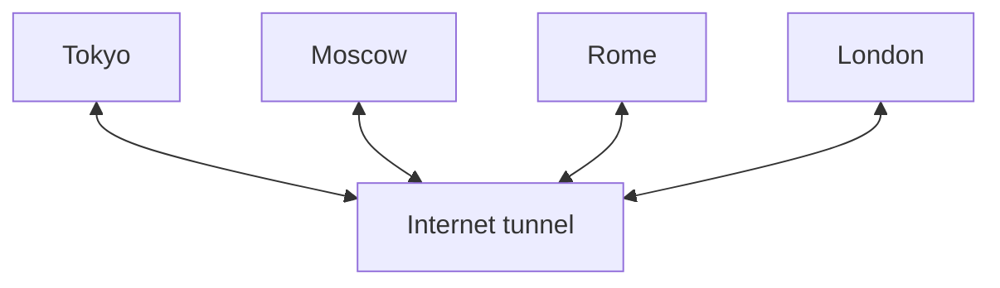

Все города связаны интернет-туннелями.

Когда Токио и Москва будут связаны серией физических узлов, Viphilama
изменит сеть следующим образом:

All the cities are linked with Internet tunnels.

When Tokyo and Moscow will be linked by a series of physical nodes, Viphilama
will change the net in this way:

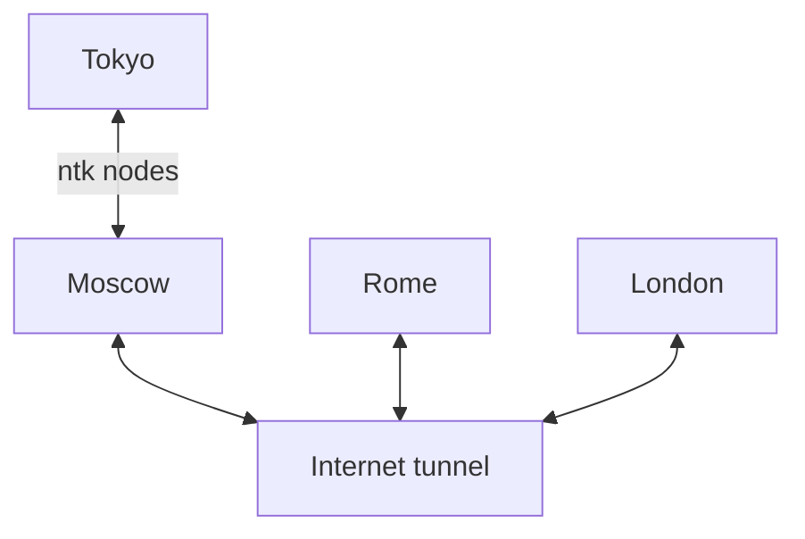

Когда даже Москва и Рим будут связаны физическими узлами:

When even Moscow and Rome will be linked by physical nodes:

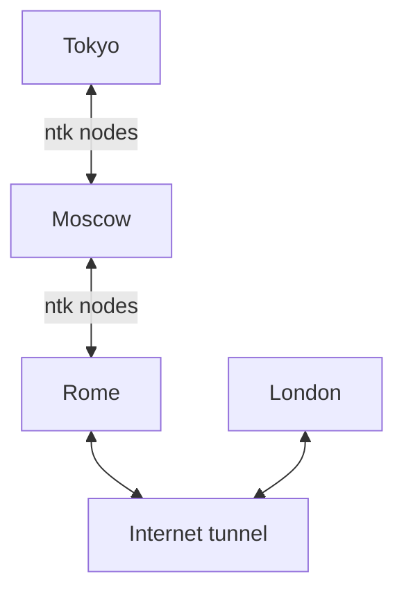

And finally:

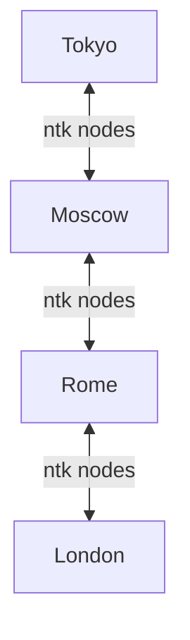

Это только общее описание идеи Viphilama, на самом деле, реализация немного сложнее ;)

This is only the general description of the Viphilama idea, actually, the
implementation is a bit more complex ;)


# Layer

Netsukuku будет разделен на два слоя: виртуальный и физический.

Netsukuku will be split in two layer: the virtual layer and the physical one.

## The physical layer

Физический уровень — это исходный уровень Netsukuku: каждый узел связан с другими узлами физическими связями (Wi-Fi, кабели, ...). Физический уровень имеет приоритет над виртуальным.

The physical layer is the original Netsukuku layer: every node is linked to
other nodes by physical links (wifi, cables, ...).
The physical layer is prioritised over the virtual one.

## The virtual layer

Виртуальный уровень строится на основе Интернета или любой другой существующей сети. Узлы Netsukuku на этом уровне связаны друг с другом туннелями.

The virtual layer is built upon the Internet or any other existing network.
The Netsukuku nodes, in this layer, are linked each other by tunnels.

### Координаты Coordinates

Узел, чтобы присоединиться к виртуальному слою, должен знать свои физические
координаты. 
Использование географических координат необходимо для Viphilama, поскольку он должен
сопоставить виртуальный слой с физическим, и ему нужен способ измерения
эффективного расстояния между двумя виртуальными узлами.

Координаты можно получить с помощью онлайн-сервиса карт, например,
http://maps.google.com или с помощью GPS.

Координаты хранятся на карте Viphilama, которая структурирована
таким же образом, как карты Netsukuku.

На первом уровне находятся координаты каждого отдельного узла.
На более высоких уровнях координаты, которые определяют местоположение гнода, устанавливаются на его
барицентр: это среднее значение координат всех его внутренних узлов.

(Подробное описание карты Viphilama находится в разделе «Карта Viphilama»).

Координаты не влияют на анонимность пользователя хуже, чем Интернет, на самом деле, можно сделать предположение о географическом
местоположении IP (см. xtraceroute).
Если пользователь не указывает свое точное местоположение, то метод xtraceroute
будет использован для получения приблизительного местоположения.

Два узла могут иметь одинаковые координаты. Это происходит, когда они используют неточные
координаты, т. е. xtraceroute связывает одно и то же местоположение с двумя IP-адресами
одного и того же города. В этом случае разница их IP-адресов будет использоваться как
(неточная) мера расстояния.
Или другими словами:

Пусть d(X, Y) будет физическим расстоянием между узлом X и Y.
Если d(X,Y) равно нулю, то d(X,Y) равно разнице IP-адресов
X и Y.


A node, in order to join in the virtual layer, has to know its physical
coordinates. 
The use of geographical coordinates is required for Viphilama, because it has
to map the virtual layer to the physical one and it needs a way to measure
the effective distance between two virtual nodes.

The coordinates can be retrieved using an online map service like
http://maps.google.com or with a GPS.

The coordinates are stored in the Viphilama map which is structured in the
same way of the Netsukuku maps.
In the first level, there are the coordinates of each single node.
In the higher levels, the coordinates which locate a gnode are set to its
barycenter: it is the average of the coordinates of all its internal nodes.
(The detailed description of the Viphilama map is in the "Viphilama map"
section).

The coordinates don't affect the anonymity of the user worse than the
Internet does, in fact, it is possible to make a guess about the geo location
of an IP (see xtraceroute).
If the user doesn't specify its accurate location, then the xtraceroute method
will be used to retrieve an approximated location.

Two nodes may share the same coordinates. This happen when they use inaccurate
coordinates, i.e. xtraceroute associates the same location to two IPs of the
same city. In this case, the difference of their IPs will be used as an
(inaccurate) measure of the distance.
Or in other words:

	Let d(X, Y) be the physical distance between the node X and Y.
	If d(X,Y) is zero then d(X,Y) is equal to the difference of the IP of
	X and Y.

### Terminology

Виртуальный уровень состоит из тех же элементов, что и физический уровень, поэтому они имеют те же имена, но с префиксом «v».

The virtual layer is composed by the same elements of the physical layer, for
this reason they have the same names but the are prefixed with 'v'.

 node   ->  vnode

 rnode  ->  vrnode

 gnode  ->  vgnode

 ...

### Gate node

Два слоя соединены узлами gate. Это узлы, которые принадлежат
обоим слоям.
Это означает, что два слоя образуют уникальную сеть.

Сокращенное название узла 
gate — просто «gate», таким образом его не путают с 
gnode (узлом группы).


The two layers are joined by the gate nodes. They are nodes which belong to
both layers.
This means that the two layers form a unique network.

The short name of a gate node is simply "gate", in this way it isn't confused
with gnode (group node).

# Virtual to Physical mapper

Viphilama — это супервизор топологии всей сети, он формирует
виртуальный слой и объединяет его с физическим, пытаясь достичь наилучшего
баланса.

Он следует простым правилам:


Viphilama is the supervisor of the topology of the entire net, it shapes the
virtual layer and merges it with the physical one trying to achieve the best
balance.

It follows simple rules:

* Viphilama просто оптимизирует топологию сети.

* Физический уровень имеет приоритет

* Виртуальный уровень, с точки зрения Netsukuku, должен быть таким же, как физический уровень, поэтому не допускается использование специализированной сети, такой как Kademlia, для формирования его топологии. Это приводит к потере производительности, поскольку виртуальный уровень не оптимизирован для нижней сети (Интернета), но обеспечивает согласованность в сети Netsukuku.

* Каждый узел должен быть подключен физическими или виртуальными связями к своим ближайшим узлам.

* Если узел A физически подключен к B, то A является одним из ближайших узлов к B и наоборот.

* Сеть должна избегать любой фрагментации, стараясь всегда быть компактной.


 
 * Viphilama just optimises the topology of the network.

 * The physical layer is prioritised

 * The virtual layer, from the point of view of Netsukuku, has to be the same of the physical layer, therefore it is not allowed to use specialized network like Kademlia to shape its topology. This leads to a loss of performance, because the virtual layer isn't optimised for the lower network (the Internet), but it ensures consistency in the Netsukuku network.

 * Each node has to be connected, with physic or virtual links, to its nearest nodes.

 * If the node A is linked physically to B, then A is one of the nearest node to B and vice versa.

 * The network must avoid any fragmentation, trying to be always compacted.


Давайте углубимся в детали.


Let's go into the details.

## Virtual hooking

Узел, не имеющий физических соседей, находится в черной зоне и по этой причине не может подключиться к физическому уровню. Если у него есть доступ к другой сети, то есть к Интернету, он напрямую подключится к vnode, присоединившись к виртуальному уровню.
Пусть этот узел подключения будет H.


A node, which hasn't any physical neighbours, resides in a black zone and, for
this reason, it can't hook to the physical layer. If it has access to another
network, i.e. the Internet, it will hook directly to a vnode, joining the
virtual layer.
Let this hooking node be H.

### Searching for the nearest vrnode

Первая часть виртуального подключения — это создание виртуальных соединений (IP-туннелей) между H и его ближайшими vrnodes.

Сначала H выбирает случайный vnode, который может быть расположен в любой точке
земного шара. Этот узел называется Entry Node (EN), поскольку это первый узел
виртуальной сети, с которым связывается H.

Если H подключается к виртуальному слою в первый раз, он выберет Entry Node из общедоступного списка EN, доступного в Интернете, в противном случае он будет
обращаться к своему кэшированному списку. Каждый перечисленный EN связан со своими собственными географическими
координатами, поэтому H может выбрать свой ближайший Entry Node.
Пусть выбранный Entry Node будет V.

H отправляет V пакет, содержащий его координаты и случайный идентификатор.
V сверяется со своей картой и пересылает полученный пакет в гнод G, который
является ближайшим к H.
Пакет будет пересылаться до тех пор, пока не попадет в I, ближайший узел к H, который
принадлежит гноду G.
В этот момент I отправляет пакет ACK в H и включает в него идентификатор.
Таким образом он подтверждает, что действительно получил исходный пакет, отправленный H.

I является первым vrnode H и называется узлом привязки (anode).


The first part of the Virtual Hooking is the creation of virtual links
(ip tunnels) between H and its nearest vrnodes.

H chooses, at first, a random vnode which can be located anywhere in the
globe. This node is called Entry Node (EN), since it is the first node of the
virtual network contacted by H.

If it's the first time H hooks to the virtual layer, it will choose the Entry
Node from a public list of ENs available on the Internet, otherwise it will
consult its cached list. Each listed EN is associated to its own geographic
coordinates, thus H can choose its nearest Entry Node.
Let the chosen Entry Node be V.

H sends to V a packet containing its coordinates and a random ID.
V consults its map and forwards the received packet to the gnode G, which is
the nearest to H.
The packet will be forwarded until it gets to I, the nearest node to H, which
belongs to the gnode G.
At this point, I sends an ACK packet to H and includes in it the ID. 
In this way it certifies that it has truly received the original packet, sent
by H.

I is the first vrnode of H and it's called Anchorage Node (anode).

### Linking to other anchorage nodes

Поскольку только одного vrnode на vnode недостаточно для балансировки сети, H
будет связываться с другими vnode `anchor_links`. Эти vnode являются ближайшими к
H. `anchor_links` — это значение, пропорциональное пропускной способности H.

Узел I добавляет свой IP-адрес Интернета к полученному пакету и пересылает его
снова на узел T, так что d(H,T) ~= d(H,I).
Узел T сделает то же самое (добавит свой IP-адрес и перешлет pkt).
Когда пакет будет переслан в `anchor_links`-й раз или когда его
больше не получится пересылать, он отправляется обратно на узел H.

Узел H собирает этот последний пакет и создает виртуальную ссылку (туннель) для
каждого IP-адреса Интернета, который был сохранен в самом пакете.

Эти связанные узлы являются новыми vrnodes узла H. Они также являются его
узлом привязки.


Since only one vrnode per vnode is not sufficient to balance the network, H
will link to other `anchor_links` vnodes. These vnodes are the nearest to
H. `anchor_links` is a value proportional to the bandwidth of H.

The node I appends its Internet IP to the received packet and forwards it
again to a node T, so that d(H,T) ~= d(H,I).
The node T will do the same (adds its IP and forwards the pkt).
When the packet will be forwarded for the `anchor_links`-th time or when it
can't be forwarded anymore, it is sent back to the node H.

The node H collects this last packet and creates a virtual link (tunnel) to
each Internet IP which has been stored in the packet itself. 
These linked nodes are the new vrnodes of the node H. They are also its
Anchorage Node.

### Reordering the virtual layer

В этот момент узел H будет подключаться к каждому связанному узлу. Эта процедура называется
перестановкой ссылок:

Пусть L будет общим vrnode H.

Возможно, некоторые vrnode L находятся ближе к H, в этом случае они
должны быть связаны с H вместо L. Например:


At this point the node H will hook to each linked node. This procedure is
called link-swapping:

Let L be the generic vrnode of H.

It is possible that some vrnodes of L are nearer to H, in this case they
should be linked to H instead of L. For example:


1. Initial configuration 
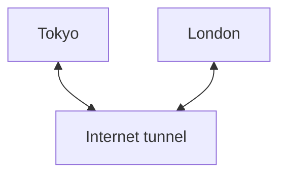

2. Rome vhooks to London.
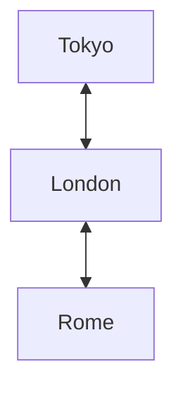

3. Since Rome is nearer to Tokyo than London, the links are reordered in their final configuration:
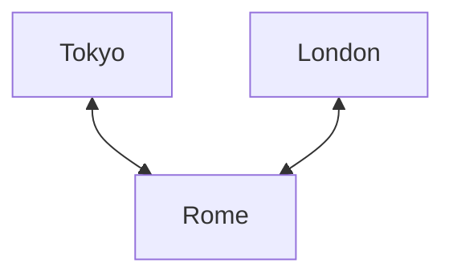

Переупорядочивание ссылок работает следующим образом:

H отправляет запрос I_AM_VHOOKING в L.

L анализирует свои виртуальные rnodes и сравнивает d(L,vR) с d(H,vR), где vR — это
vrnode. Если d(H,vR) < d(L,vR), L добавляет IP-адрес Интернета vR в ответный
пакет.

H получает ответный пакет L и пытается создать виртуальную ссылку на каждый
vR, указанный в том же пакете.

H записывает список всех узлов vR, которые были успешно связаны с H. Этот список отправляется обратно в L.

L читает этот последний список и удаляет все свои ссылки на узлы vR, которые были успешно связаны с H.

Эта же процедура повторяется для каждого vrnode H.

В конце концов, H выбирает один из своих vrnodes и подключается к нему классическим
методом.


The reordering of the links works in this way:

H sends the I_AM_VHOOKING request to L.

L analyses its virtual rnodes and compares d(L,vR) to d(H,vR), where vR is a
vrnode. If d(H,vR) < d(L,vR), L adds the Internet IP of vR in the reply
packet.

H receives the reply packet of L and tries to create a virtual link to each
vR listed in the same packet.
H writes the list of all the vR nodes which has been successfully linked to H
itself. This list is sent back to L.

L reads this latter list and deletes all its links to the vR nodes, which has
been successfully linked to H.

This same procedure is repeated for each vrnode of H.

In the end, H chooses one of its vrnodes and hooks with the classical method
to it.

### Gate hooking

Когда узел вентиля физически связан с другим узлом вентиля, они используют процедуру v-связывания для переупорядочивания своих связей.


When a gate node is linked physically to another gate node, they use the
v-linking procedure to reorder their links.

## Virtual topology

Узел H останется виртуально связанным с общим узлом L, если и только если
нет физического маршрута, соединяющего H с L.

Когда H замечает (анализируя пакеты QSPN), что L можно достичь через
физический маршрут, он удаляет виртуальную ссылку.

Обратите внимание, что vnode, который не имеет никаких виртуальных ссылок, но подключен к
Интернету и физическим узлам ntk, всегда является vnode. Фактически, подключающийся vnode
может создать виртуальную ссылку на него.


The node H will remain virtually linked to a generic node L if and only if
there isn't a physical route which connects H to L.

When H notices (analysing the QSPN packets) that L can be reached through a
physical route, it deletes the virtual link.

Note that a vnode which hasn't any virtual links but is connected to the
Internet and to physical ntk nodes is always a vnode. In fact, a hooking vnode
may create a virtual link to it.

## Anchorage node

Первые vrnodes, связанные с узлом, который только что подключился к виртуальному слою, являются узлами привязки.

Связи с узлами привязки никогда не разрушаются.

Каждый узел всегда будет пытаться оставаться связанным со своими анодами (вот почему они называются узлами привязки), таким образом, топология сети не будет
фрагментирована.

Например:


The first vrnodes linked to the node, which has only just hooked to the virtual
layer, are the Anchorage Nodes.

The links to the Anchorage Nodes are never destroyed.

Every node will always try to remain linked to its anodes (that's why they're
called anchorage nodes), in this way, the topology of the net won't be
fragmented.

For example:
```
graph TD
    G(group of vnode) <--> H
    H <--> AN
    AN <--> X(rest of the virtual layer)
```

Если H удалит свою ссылку на свой якорный узел AN, группа vnode G останется изолированной.

Каждый узел будет связан с числом анодов, пропорциональным его пропускной способности.


If H deletes its link to its anchorage node AN, the group of vnodes G will be
left isolated.

Each node will be linked to a number of anodes proportional to its bandwidth.

### Anchorage Nodes and the Link Swapping procedure

Процедура обмена ссылками просто сместит положение узла привязки. Например:


The link swapping procedure will just shift the Anchorage Node position. For
example:

1. Initial condition
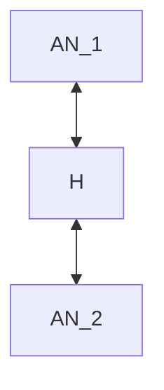

2. The node N creates a vlink to H	
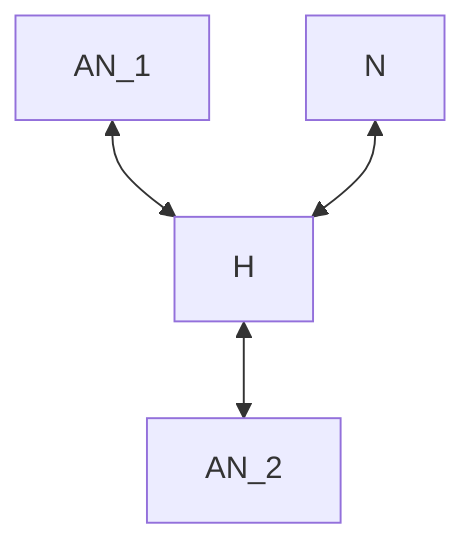

3. N swaps the link with H
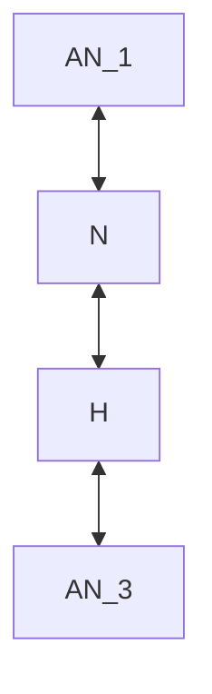
	
4. N becomes another anode of H, while AN_3 becomes a normal vnode
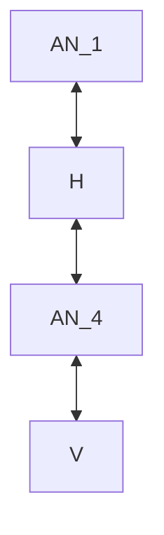

### Death and rebirth of an Anchorage Node

Когда один или несколько анодов умирают, vnode восстанавливает свое оптимальное количество
анодов: он использует один из оставшихся анодов в качестве узла входа, создавая все
необходимые vlinks к новым узлам привязки.

Если все аноды умирают, vnode повторно подключается к виртуальному слою, сохраняя
все свои остальные vrnodes.

Узлы привязки всегда должны быть узлами, к которым нельзя добраться через
физический маршрут.


When one or more anodes die, the vnode will reestablish its optimal number of
anodes: it uses one of the remaining anodes as an entry node, creating all the
necessary vlinks to the new anchorage nodes.

If all the anodes die, the vnode will re-vhook to the virtual layer, keeping
all its other vrnodes.

The anchorage nodes must be always nodes which can't be reached through a
physical route.

## Viphilama map

Карта Viphilama похожа на карты Netsukuku, но вместо сохранения
`rtt` узлов и их маршрутов она просто сохраняет их координаты.
Она также разделена на уровни.

На карте мультибарицентр связан с каждым (g)узлом.


The Viphilama map is similar to the Netsukuku maps, but instead of keeping the
`rtt` of the nodes and their routes it just maintains their coordinates.
It is divided in levels too.

In the map, the multi-barycenter is associated to each (g)node.

### Multi-barycenter

В идеальном случае узел будет компактным и плотным, а его барицентр будет
находиться точно в его центре. 
В этом случае можно рассматривать узел как одну точку, таким образом, на более высоком уровне, было бы достаточно знать только его барицентр, а не все координаты его узлов. 
Однако это не всегда верно, например, рассмотрим этот групповой узел:


In the ideal case, a gnode would be compact and dense and its barycenter would
be exactly in its centre. 
In this case it is possible to consider the gnode as a single point, thus, in 
the higher level, it would be sufficient to known only its barycenter instead
of all the coordinates of its nodes.
However, this isn't always true, foe example, consider this group node:
```
          .  .
        .  . .                               .
          .   .        +                    . 
         .  . .            O

        
    .  a node
    +  the barycenter
    O  another node
```

Все точки являются узлами (nodes) одного и того же узла (gnode). Узлы слева хорошо
сгруппированы, в то время как два узла справа находятся далеко от них.
Центр масс находится в пустой области: ни одного узла группы узлов нет.

В этом случае координаты центра масс вводят в заблуждение, например, узел
O считает, что узел
O находится очень близко к себе, но на самом деле, это просто центр масс, который
находится близко.

Решение состоит в том, чтобы использовать мульти-барицентр вместо одного
барицентра: барицентр назначается каждому блоку узлов, который
образует узел.
В приведенном выше примере будет два барицентра, один для блока
слева, а другой для блока справа.

Мульти-барицентр одного узла совпадает с его центром масс.
Мульти-барицентр может быть также назначен группе более высоких уровней (группе
групп узлов и т. д.).

Очевидно, что использование большего количества координат требует большего использования памяти, однако,
при увеличении количества узлов блоки становятся более уплотненными, поэтому
их количество и количество барицентров уменьшается.


All the points are nodes of the same gnode. The nodes on the left are well
grouped, while the two nodes on the right are far away from them.
The barycenter is in an empty area: not a single node of the group node is
there.

In this case, the coordinates of the barycenter are misleading, f.e. the node
O believes that the gnode is very near to itself, but actually, it is just the
barycenter which is near.

The solution is to use the multi-barycenter, instead, of a single
barycenter: a barycenter is assigned to each block of nodes which forms the
gnode.
In the example above, there would be two barycenters, one for the block
on the left and the other for the block on the right.

The multi-barycenter of a single node coincides with its barycenter.
The multi-barycenter can be also assigned to group of higher levels (group of
group of nodes, etc...).

Obviously, using more coordinates requires a higher use of memory, however,
when the number of nodes increases, the blocks become more compacted, thus
their number and that of the barycenters decreases.

## Concurrency

Пусть H и G будут двумя близкими узлами, которые подключаются почти одновременно (сначала H, затем G).
Внутренняя карта подключенного узла не будет обновлена ​​немедленно, поэтому
G не заметит присутствия H и подключится к другому узлу.

Со следующим QSPN внутренняя карта узла будет обновлена, H заметит, что G является его ближайшим узлом, и наоборот.

Узел с наименьшим IP создаст новый vlink к другому
(не удаляя свои старые vlink), таким образом H и G будут связаны.


Let H and G be two near nodes that vhook nearly at same time (first H then G).
The internal map of the hooked gnode, won't be updated immediately, therefore
G won't notice the presence of H and will hook to another node.

With the next QSPN, the internal map of the gnode will be updated, H will
notice that G is its nearest node and vice versa.

The node which has the smallest IP will create a new vlink to the other
(without deleting its old vlinks), in this way H and G will be connected.

## Load balancing ##

Все узлы, имеющие подключение к Интернету, должны быть узлами-шлюзами. 
Таким образом, трафик, проходящий по виртуальному слою, будет хорошо сбалансирован.
Например, два отдельных физических узла будут связаны максимальным количеством виртуальных соединений.

All the nodes, which have an Internet connection, should be gate nodes. 
In this way, the traffic passing on the virtual layer will be well balanced.
For example, two separated physical gnodes will be linked with the maximum
number of virtual links.

```
                   virtual links
                   ___ ... ____
                  /___ ... ____\
                 /____ ... _____\
                /                \
        Gnode A ------ ... ------- Gnode B
                \_____ ... ______/
                 \____ ... _____/
                  \___ ... ____/
                   virtual links
```

## Internet Gateway Search ##

Узел не может подключиться к виртуальной сети, используя интернет-подключение, предоставленное
через систему IGS (см. NTK_RFC 003).

Узел vnode может предоставить свое интернет-подключение только другим узлам, которые
физически доступны.


A node cannot hook to the virtual network using an Internet connection shared
through the IGS system (see NTK_RFC 003).

A vnode can share his Internet connection only to other nodes which are
physically reachable.

## The end of Viphilama ##

Когда все узлы будут связаны физическими ссылками, Viphilama автоматически прекратит работу. Фактически, всегда будет физический маршрут,
который соединяет любой другой узел, и поэтому все виртуальные ссылки будут удалены.


When all the nodes will be linked with physical links, Viphilama will
automatically cease to operate. In fact, there will be always a physical route
which connects any other node and therefore all the virtual links will be
deleted.

# Entry nodes and servers

Первый vnode, к которому обращается узел, который подключается к виртуальному слою, — это узел входа (EN).

Серверы входа ведут публичный список узлов входа.


The first vnode contacted by a node, which is hooking to the virtual layer,
it's the Entry Node (EN).

The Entry Servers keep a public list of Entry Nodes.

## Entry node

EN — это обычный vnode, который принимается для включения в публичный список, поддерживаемый серверами входа. 
EN должен иметь как минимум среднюю пропускную способность.

Узел входа, чтобы быть зарегистрированным в публичном списке, периодически отправляет обновление серверу входа:

* EN связывается с сервером входа и получает его Netsukuku IP.

* EN загружает билет с сервера входа. Билет — это просто уникальный номер, сгенерированный в данный момент, который должен быть загружен исключительно с виртуального уровня. Билет используется ES для проверки того, что EN действительно является vnode.

* EN отправляет пакет обновления в ES через Интернет. Пакет содержит билет, координаты EN и его уникальный идентификатор. Идентификатор — это случайная строка, сгенерированная EN при отправке своего первого обновления. Идентификатор используется ES для идентификации EN.

* через 300 секунд EN снова отправляет обновление, используя ту же процедуру.

Если указано в параметрах ntkd, vnode может стать узлом входа после 3 дней бесперебойной работы.


An EN is a normal vnode which accepts to be listed on the public list
maintained by the Entry Servers. 
An EN should have at least a medium bandwidth.

The Entry Node, in order to be registered in the public list sends
periodically an update to an Entry Server:

* the EN contacts the Entry Server and gets its Netsukuku IP.

* the EN downloads a ticket from the Entry Server. The ticket is just a unique number generated on the moment, which must be downloaded exclusively from the virtual layer. The ticket is used by the ES to verify that the EN is actually a vnode.

* the EN sends the update packet to the ES over the Internet. The packet contains the ticket, the coordinates of the EN and its unique ID. The ID is a random string generated by the EN when it sends its first update. The ID is used by the ES to identify the EN.

* after 300 seconds the EN sends again the update using the same procedure.

If specified in the ntkd options, a vnode can become an Entry Node after 3
days of uptime.

## Entry Server

Entry Server — это выделенный сервер, который хранит публичный список EN.
Список упорядочен по времени безотказной работы, поэтому самые старые EN находятся наверху.

Если EN не отправляет обновление, он удаляется из списка.

Может быть несколько ES, соединенных вместе. Каждый ES знает некоторые другие доверенные
ES, которые, в свою очередь, должны доверять ему. Доверенные ES делятся своим открытым
ключом RSA. Когда один ES получает обновление от EN, он пересылает пакет обновления
своим доверенным ES, подписывая его своим закрытым ключом. Доверенные ES пересылают пакет обновления
своим доверенным ES и так далее.


The Entry Server is a dedicated server which keeps the public list of ENs.
The list is ordered by uptime, thus the oldest ENs are on top.

If an EN doesn't send the update, it is removed from the list.

There can be multiple ESs chained together. Each ES knows some other trusted
ESs, which in turn have to trust it. The trusted ESs share their RSA public
key. When one ES receives an update from an EN, it forwards the update pkt to
its trusted ESs, signing it with its private key. The trusted ESs forwards the
update pkt to their trusted ESs, and so on.

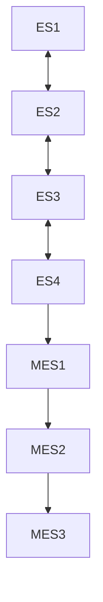

Есть также Mirror Entry Server. Они имеют привилегии только на чтение, т. е.
они могут только получать обновления от ES или другого MES, но не могут отправлять их ни в какой ES.

There are also the Mirror Entry Server. They have read-only privileges, i.e.
they can only receive an update from an ES or another MES, but they can't send
it to any ES.

### Downloading the Entry Node list

Узел, который подключается к виртуальному слою, загрузит список узлов входа в нескольких случаях:

* Когда он подключается к виртуальному слою в первый раз

* Когда все узлы входа, присутствующие в его кэшированном списке, недоступны

Когда узел загружает список, он выполняет следующие шаги:

* он выбирает ближайший ES или MES, например, если он находится в Японии, он выбирает сервер входа .jp.

* он дает ES свои собственные координаты

* наконец, сервер входа дает узлу список из 16 случайных узлов входа, которые находятся рядом с координатами, указанными узлом.

---- 

Не стесняйтесь помогать разработке Viphilama.


A node, which is hooking to the virtual layer, will download the Entry Node
list in few cases:

* When it is hooking for the very first time to the virtual layer

* When all the Entry Nodes present in its cached list are unreachable

When the node downloads the list it follows these steps:

* it chooses a near ES or MES, f.e. if it is in Japan it chooses a .jp Entry Server.

* it gives to the ES its own coordinates

* finally, the Entry Server gives to the node a list of 16 random Entry Node which are near to the coordinates specified by the node.

---- 

Feel free to help the development of Viphilama.
